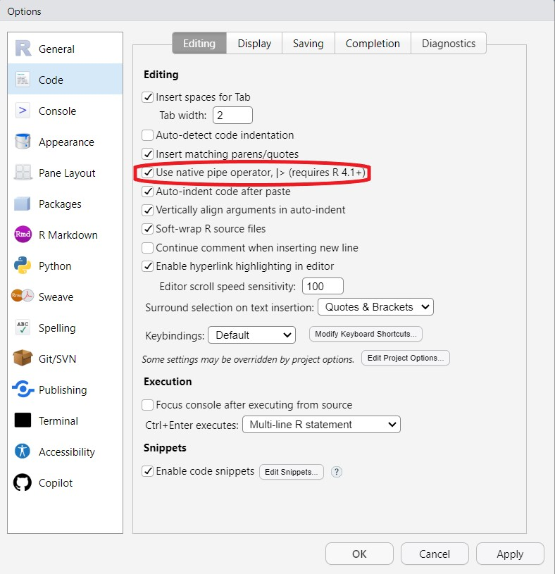

#### Intro {.tabset}
<h4><b>Why I like the tidyverse</h4></b>
<ol>
<li>Data are organized in a tidy way, such that observations are rows and variables are columns.</li>
<li>All functions within the tidyverse start with data as the first argument, allowing you to chain functions together via the pipe operator. </li>
<li>The learning curve isn't as steep as base R, and code tends to be easier to follow than base R.</li>
<li>Many of the functions, especially dplyr, perform faster than base R. If you're working with large datasets, performance can make a difference.</li>
<li>The `waterNETN` package is tidyverse-compatible, allowing you to use pipes with its functions. </li>
</ol>
<br>

<h4><b>A tail of two pipes</b></h4>
<ul>
<li><b class = 'fxn'>%>%</b> was the original pipe operator was part of the `magrittr` package, which also was inherited in `dplyr`. To use the %>%, you had to load either of those packages (or `tidyverse`).</li>
<li><b class = 'fxn'>|></b> is the base R operator, that is installed with R. This became available with R 4.0, and is supposed to perform faster than the %>%. There are some slight differences between the two, but in general, you won't notice the difference. I prefer the base pipe (|>) because you don't need to load any packages to use. </li>
</ul>

<div class="alert alert-info">
R Tip: Keyboard shortcut for the pipe (Ctrl + Shift + M):
<details><summary class = 'drop'>Open drop down for more info, including setting the native pipe as default for keyboard shortcut.</summary>
<ul>
<li>Both pipes are a bit awkward to type. Fortunately, there's a keyboard shortcut: Ctrl + Shift + M</li>
<li>By default, RStudio will translate that shortcut to the magrittr pipe (%>%), but you can change this by going to Tools > Global Options > Code. Check the "Use native pipe operator, |>" box. </li>
</ul>

```{r echo = F, height = 5}

```
</details>
</div>
</br>

#### Pipe Demo 
<h4><b>Background</b></h4>
To see what piping looks like, we'll first load the libraries and import the data. Note that you don't need to load the `tidyverse` to use the base R pipe, but I frequently use packages within `tidyverse` when I'm coding, so I often load it all in one, rather than each individual package. In contrast, when building functions in packages, it's best to only load packages you need and use base R as much as possible. Base R what comes in as part of the installation of R, and doesn't require you to load any packages to use.  

<p class = "fxn">Load or package and import data.</p>
```{r results = 'hide'}
library(waterNETN)
importData()

```

<p class = "fxn">Load the tidyverse. Note the list of packages that load when you load the tidyverse.</p>
```{r}
library(tidyverse)
```
<br>

<h4><b>How piping works:</b></h4>
<p class = 'fxn'>Without pipes:</p>
Say we want to get pH for lower NETN, drop SAIR, and only include SiteCode, park, year, month, param and value columns. Without pipes, every step has a different output and code takes a second to follow.
```{r}
# get the data
wdat1 <- getSondeInSitu(park = "LNETN", years = 2023, parameter = 'pH')
# filter out SAIR
wdat1b <- subset(wdat1, UnitCode != "SAIR") #subset it base R's way to filter data
# select only the columns you want
wdat1c <- wdat1b[,c("SiteCode", "UnitCode", "year", "month", "param", "value")]
# rename UnitCode to park 
names(wdat1c)[names(wdat1c) == "UnitCode"] <- "park"
# view output
table(wdat1c$park)
names(wdat1c)
```
<br>
<p class = 'fxn'>With pipes:</p>
The entire process can be done with 1 named object and 2 pipes, and the steps taken are pretty easy to follow, even if you don't know R.
```{r}
wdat2 <- getSondeInSitu(park = "LNETN", years = 2023, parameter = "pH") |> 
           filter(UnitCode != "SAIR") |> 
           select(SiteCode, park = UnitCode, year, month, param, value) 
```
<br>


#### Ode to dplyr and other packages 
<h4><b>dplyr functions</b></h4>
The <b class = 'fxn'>dplyr</b> package does a lot of the heavy lifting for data wrangling. The functions I use most often are:
<ul>
<li><b class = 'fxn'>filter</b>: Removes rows based on specified condition. Therefore, it makes a data frame smaller.</li>
<li><b class = 'fxn'>select</b>: Removes columns based on specified condition. Therefore, it makes a data frame narrower. It also allows you to rename a column within the select()!</li>
<li><b class = 'fxn'>mutate</b>: Creates a new column. The results of mutate will always return the same number of rows as the original data frame.</li>
<li><b class = 'fxn'>arrange</b>: Orders/sorts by named columns </li>
<li><b class = 'fxn'>group_by</b>: Allows you to group by one or more columns, like park and year. </li>
<li><b class = 'fxn'>summarize</b>: This function goes hand in hand with group_by() to then summarize by the grouping columns. Different from mutate(), the summarize() function always returns fewer rows than the original data frame.</li>
<li><b class = 'fxn'>the join family</b>: dplyr includes joins like left_join, right_join, full_join, and inner_join to specify how to combine two datasets. This forces you to think about how you're joining the data. In contrast, by default MS Access uses inner joins unless you change them manually. Using an inner join means that only rows that have a match on both datasets are carried into the resulting dataset.</li> 
</ul>
<br>
<h4><b>dplyr in action</h4></b>
The code below takes daily climate data from Daymet, calculates a new column that's an average of the min and max temperatures (Daymet doesn't provide average daily temperature). Next, the data are grouped by site, year, and month, then the summarize function helps us calculate the means for each of the metrics of interest. 
```{r}
# Get daily climate data
temp <- getClimDaymet(site = "MIMASB", years = 2020:2023) |> 
  mutate(mon = as.numeric(substr(Date, 6, 7)),
         dm_tmean_degc = (dm_tmax_degc + dm_tmin_degc)/2)

# Group by site, year, and month to calculate the average temps.
temp2 <- temp |> 
  group_by(SiteCode, year, mon) |> 
  summarize(avg_minC = mean(dm_tmin_degc),
            avg_maxC = mean(dm_tmax_degc),
            avg_meanC = mean(dm_tmean_degc),
            .groups = 'drop') 


```
<br>
<h4><b>Other packages I frequently use are:</b></h4>
<ul>
<li><b class = 'fxn'>tidyr</b>: for reshaping datasets from long to wide and vise versa (e.g., pivot_wider() and pivot_longer()). </li>
<li><b class = 'fxn'>lubridate</b>: for working with time and date columns. </li>
<li><b class = 'fxn'>ggplot2</b>: for plotting data (see ggplot tab for more on that package). </li>
</ul>
<br>