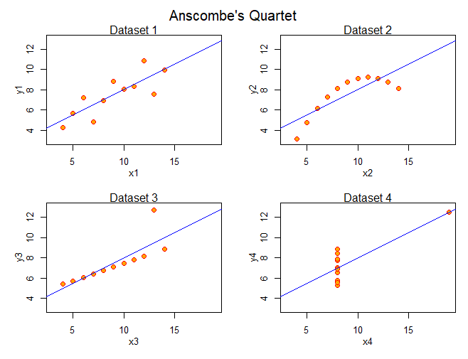

```{r include = F}
library(tidyverse)
library(patchwork)
library(GGally)
library(plotly)
library(ggthemes)
```


#### Data Viz 101
This section is taken almost verbatum from the data visualization training Ellen Cheng put together for IMD Intro to R Training in Februray 2022. All good credit goes to her. All bad credit goes to me.

<details open><summary class='drop'>The Power of (Good) Data Visualizations</summary>

**Data are useful only when used. Data are used only when understood.**

<br>
Consider three examples:

<h3>Example 1. Plots convey messages faster than tables</h3>

Most people can understand this...

<center>![Average daily Covid cases per 100k people, by region (Sources: State and local health agencies [cases]; Census Bureau [population data]](images/covid_by_region.png)</center>

<br>
faster than they can understand this...
<br>

<details open><summary class='drop2'>Table of Covid cases</summary>
```{r, echo = FALSE, message = FALSE, warning = FALSE}
covid_numbers <- read.csv("./data/covid_numbers.csv")
head(covid_numbers, 7) |> 
  knitr::kable(align = "c", caption = "Daily Covid cases and population numbers by state (only showing first 7 records)") |> 
  kableExtra::kable_styling(full_width = F)
```
</details>

<h3>Example 2. Plots reveal patterns and highlight extremes</h3>

This table shows average monthly revenue for Acme products. 

```{r acme_table, echo = FALSE, message = FALSE, warning = FALSE}
acme_in <- read.csv("./data/acme_sales.csv") |> 
  dplyr::arrange(category, product) 

acme_in |> 
  knitr::kable(align = "c", caption = "Average monthly revenue (in $1000's) from Acme product sales, 1950 - 2020") %>%
  kableExtra::kable_styling(full_width = F)
```


<details open><summary class='drop2'>Table as Heat Map</summary>
Now let's display the same table as a heat map, with larger numbers represented by darker color cells. How quickly can we answer those same two questions? What patterns can we see in the heat map that were not obvious in the table above?

```{r acme_heatmap, echo = FALSE, fig.width = 9, fig.align="center", message = FALSE, warning = FALSE}

acme <- acme_in  |> 
  pivot_longer(-c(category, product), names_to = "month", values_to = "revenue")
acme$month <- factor(acme$month, levels = month.abb)

ggplot(acme, aes(x=month, y=product, fill=revenue)) + 
  geom_raster() +
  geom_text(aes(label=revenue, color = revenue > 1250)) + # color of text conditional on revenue relative to 1250
  scale_color_manual(guide = "none", values = c("black", "white")) + # set color of text
  scale_fill_viridis_c(direction = -1, name = "Monthly revenue,\nin $1000's") +
  scale_y_discrete(limits=rev) + # reverses order of y-axis bc ggplot reverses it from the data
  labs(title = "Average monthly revenue (in $1000's) from Acme product sales, 1950 - 2020", x = "Month", y = "Product") + 
  theme_bw(base_size = 12) +
  facet_grid(rows = vars(category), scales = "free") # set scales to free so each facet only shows its own levels
```
</details>
<br>

<h3>Example 3. Plots provide insights that statistics obscure</h3>

In 1973, Francis Anscombe published ["Graphs in statistical analysis"](https://garstats.files.wordpress.com/2016/08/anscombe-as-1973.pdf), a paper describing four bivariate datasets with identical means, variances, and correlations.

```{r anscombe, echo = FALSE, message = FALSE, warning = FALSE}
ansc <- anscombe  |> 
  dplyr::select(x1, y1, x2, y2, x3, y3, x4, y4) 

ansc  |> 
  knitr::kable(align = "c", caption = "Anscombe's Quartet - Four bivariate datasets with identical summary statistics")  |> 
  kableExtra::column_spec (c(2,4,6),border_left = F, border_right = T)  |> 
  kableExtra::kable_styling(full_width = F)

sapply(ansc, function(x) c(mean=round(mean(x), 2), var=round(var(x), 2)))  |> 
  knitr::kable(align = "c", caption = "Means and variances are identical in the four datasets. The correlation between x and y (r = 0.82) is also identical across the datasets.")  |> 
  kableExtra::column_spec (c(1,3,5,7),border_left = F, border_right = T)  |> 
  kableExtra::kable_styling(full_width = F)
```
<br>

<details open><summary class='drop2'>Anscombe data as plots</summary>
Despite their identical statistics, when we plot the data we see the four datasets are actually very different. 

<center>)</center>
 
<br>
Anscombe's point? TO UNDERSTAND THE DATA, WE MUST PLOT THE DATA!
</details>
</details>
<br>

<details open><summary class='drop'>Rules for Effective Data Visualizations</summary>

Anscombe used clever thinking and simple plots to demonstrate the importance of data visualizations. But it's not enough to just plot the data. To have impact, a plot must convey a clear message. How can we do this?

- **Have a purpose.** Every data visualization should tell a story. What story does the Covid plot tell? What message does Anscombe's quartet of plots convey?

- **Consider your audience.** Avoid scientific names, acronyms, or jargon unless your audience is well-versed in that language. Use color-blind friendly colors.

- **Use an appropriate visualization.** For example: 
  - Line graphs work well for showing changes in continuous data over time 
  - Bar charts compare counts or proportions in categorical data (pie charts get a bad rap in the data viz world, but can be useful in [certain situations](https://chartio.com/learn/charts/what-is-the-difference-between-a-pie-chart-and-a-bar-chart/#:~:text=As%20a%20rule%20of%20thumb%3A%201%20Use%20either,values%20...%203%20Use%20a%20bar%20chart%20otherwise))
  - For statistics (e.g., means) with confidence intervals, point plots with error bars are preferred over bar charts (nice explanation [here](https://scc.ms.unimelb.edu.au/resources-list/graphs-for-statistical-analysis/graphs))
  - Scatterplots are useful for showing the relationship (correlation) between two continuous variables.
  - Matrix heat maps can efficiently compare the magnitude of numbers when we have lots of data structured in table format, especially when colors have a clear connection to the numbers (e.g., scorecard data)
  - Box plots, violin plots, and histograms show distributions and outliers for continuous data. Dot plots are a useful alternative when sample sizes are small.
<br>  
- **Keep it simple!!!**
  - Every plot element and aesthetic should have a purpose.
  - Avoid 3D charts unless you have good reason otherwise.
  - Don't try to cram everything into one plot (e.g., juxtapose two plots instead of adding a secondary y-axis. Nice explanation [here](https://blog.datawrapper.de/dualaxis/)).
  - You shouldn't have to spend 5 minutes explaining a plot for someone to understand it. 
<br>  
- **Use informative text and arrows wisely.** Clear, meaningful titles, subtitles, axes titles/labels, and annotations help convey the message of a plot. Use lines and arrows (sparingly but effectively) to emphasize important thresholds, data points or other plot features. Fonts should be large enough with good contrast (against the background) and sufficient white space to be easily readable.
</details>
<br>

#### Intro to `ggplot2` 

```{r, echo = FALSE, eval = TRUE, warning = FALSE, message = FALSE}

viz_dat <- readRDS("Data/viz_dat.RDS")

arch_dat <- subset(viz_dat, unit_code == "ARCH") # subset of data that is for Arches National park
```

<details open><summary class='drop'>Data Used in this Section</summary>
```{r, echo = TRUE, eval = FALSE, warning = FALSE, message = FALSE}

# This section requires the `viz_dat` and `arch_dat` data frames created earlier in the module. If you don't have these data frames in the global environment, run the code below.

viz_dat <- readRDS("viz_dat.RDS") # this file is provided with the training materials. If this file is not in your current working directory, provide the file path in the function argument

arch_dat <- subset(viz_dat, unit_code == "ARCH") # subset of data that is for Arches National park
```
</details>
<br>

<details open><summary class='drop'>Packages Used in this Section</summary>
```{r, echo = TRUE, message = FALSE, warning = FALSE}

# Packages used in this section
library(tidyverse)
library(ggthemes)
```
</details>
<br>

<details open><summary class='drop'>Why `ggplot2`?</summary>
If you search the Internet for information on plotting in `R`, you will quickly learn that `ggplot2` is the most popular `R` package for plotting. It takes a little effort to learn how the pieces of a ggplot object fit together. But once you get the hang of it, you will be able to create a large variety of attractive plots with just a few lines of `R` code.  

[Reference documents]("http://r-statistics.co/ggplot2-cheatsheet.html") and [cheatsheets](https://nyu-cdsc.github.io/learningr/assets/data-visualization-2.1.pdf") can be very helpful while you are learning to use the `ggplot2` package.

So let's get started! We will build our first ggplot object step-by-step to demonstrate how each component contributes to the final plot. Our first ggplot object will re-create the line graph of trends in visits to Arches National Park.
</details>
<br>

<details open><summary class='drop'>Step 1. Create a "Master" Template for the Plot</summary>

- identify the data (must be a data frame or tibble)
- set default aesthetic mappings 

An aesthetic mapping describes how variables in the data frame should be represented in the plot. Any column of data that will be used to create the plot must be mapped to an aesthetic. Examples of aesthetics include x, y, color, fill, point size, point shape, and line type.

From the 'arch_dat' data we will map 'visitors' (in 1000's) to the y variable and 'year' to the x variable. This will set up default axes and axes titles for the plot.

<details open><summary class='drop2'>Master template with default aesthetics</summary>
```{r p1_step1, echo = TRUE, warning = FALSE, message = FALSE}

# NOTES:
# 1. The first argument provided to the `ggplot()` function is assumed to be the data frame, so it's not necessary to include the argument name `data =`.
# 2. We are assigning the plot to the name `p` so we can build on this `ggplot()` master template in the next step.
# 3. The parentheses around the line of code is a shortcut for `print`. Without it, the plot would assign to `p` but not print in the plots pane.

(p <- ggplot(data = arch_dat, aes(x = year, y = visitors/1000)))

summary(p) # summary of the information contained in the plot object

p$data # the plot object is self-contained. The underlying data frame is saved a list element in the plot object. 
```
</details>
</details>

<details open><summary class='drop'>Step 2. Add Geometry Layer(s)</summary>

The geometry layer determines how the data will be represented in the plot. We can generally think of this as the plot type. For example, `geom_hist()` creates a histogram and `geom_line()` creates a line graph. 

If we had set default data and aesthetic mappings, the geometry layer will use that information unless additional (overriding) data or aesthetics are set in the layer itself. If we had NOT set default data and aesthetics, they will need to be set within the layer. At a minimum we need to specify the data frame and which data frame columns hold the `x` and (for most plot types) `y` aesthetics. The ggplot object will use its own default values for any other aesthetics (e.g., color, size...) if not defined by the user. 

Each geometry layer has its own set of required and accepted aesthetics. For example,`geom_point()` (point plot) REQUIRES `x` and `y` aesthetics and ACCEPTS aesthetics that modify point color and size. It does NOT accept the `linetype` aesthetic. We cover plot aesthetics in more detail in the section titled 'Customizing a ggplot Object'.

<details open><summary class='drop2'>Add a line graph geometry layer</summary>
```{r p1_step2, echo = TRUE, warning = FALSE, message = FALSE}
# NOTE: We combine ggplot object layers with `+`, not with `%>%`. With a ggplot object we are not piping sequential results but rather layering pieces. In this example we are building our ggplot object in a particular order, but we could actually reorder the pieces in any way (as long as the master template is set first). The only difference would be that if different layers have conflicting information, information in later layers overrides information in earlier layers.

p + geom_line()
```
</details>

If we had NOT set default data and `x` and `y` aesthetics in the plot's master template we could have set them within the geometry layer like this:

```{r p1_step2b, echo = TRUE, eval = FALSE, warning = FALSE, message = FALSE}
# Example of setting aesthetic mappings within the layer only
ggplot() +
  geom_line(data = arch_dat, aes(x = year, y = visitors/1000))
```

<details open><summary class='drop2'>Add multiple geometry layers</summary>
We can include multiple geometry layers in a single ggplot object. For example, to overlay a point plot on the line graph we would add a `geom_point()` layer. If we had set default data and aesthetic mappings, this additional geometry would use that information unless additional (overriding) information were set in the `geom_point()` layer itself.

```{r p1_step2c, echo = TRUE, warning = FALSE, message = FALSE}
# This works because we had defined default data and aesthetics in `p`, so don't need to provide additional information to the geometry layers
p + geom_line() + geom_point() 
```

The code below will NOT add the points layer because `geom_point()` has no data or aesthetics defined, and we did not define default values in the ggplot object.
```{r, echo = TRUE, eval = FALSE}
ggplot() +
  geom_line(data = arch_dat, aes(x = year, y = visitors/1000)) +
  geom_point()
```
</details>

<details open><summary class='drop2'>Geometry layers are shortcuts for the `layer()` function</summary>

Geometry layers can alternatively be specified with the generic plot `layer()` function. Geometry layers are basically the `layer()` function with some pre-defined (default) arguments. For example, `geom_point()` is the same as `layer(geom = "point", stat = "identity", position = "identity")`. See `?layer` for more information.

```{r p1_step2e, echo = TRUE, eval = FALSE, warning = FALSE, message = FALSE}
p + layer(geom = "line", stat = "identity", position = "identity") # this creates the same line graph we had created using `geom_line()`
```
</details>
</details>

<details open><summary class='drop'>Step 3. Use `scale_...()` Functions to Fine-Tune Aesthetics</summary>

All aesthetic mappings can be fine-tuned with a `scale_...()` function. For example, the aesthetic mapping for `x` can be modified with `scale_x_continuous()` if the data are continuous, `scale_x_discrete()` if the data are categorical, and `scale_x_date()` if the data class is data/time. `ggplot2` provides default scale arguments for all aesthetic mappings. If we don't explicitly define a scale for an aesthetic, `ggplot2` will use its default scale settings.

<details open><summary class='drop2'>Modify the y-axis with `scale_y_continous()`</summary>
```{r p3_step1, echo = TRUE, warning = FALSE, message = FALSE}
# NOTES:
# 1. Our plot code is getting long, so we will separate out the components to improve readability
# 2. We will assign this plot object to the name `p2` so we can just add to `p2` in the next step instead of re-typing all these lines
# 3. `ggplot2` also provides shortcuts for some scaling arguments. For example, if we just want to set y-axis limits we can add the layer `ylim (600, 1500)` instead of setting limits via `scale_y_continuous()`

# Check out `?scale_y_continuous` for ways to modify the y-axis
(p2 <- p + 
  geom_line() + 
  geom_point() +
  scale_y_continuous(
    name = "Number of visitors, in 1000's", # y-axis title
    limits = c(600, 1500), # minimum and maximum values for y-axis
    breaks = seq(600, 1500, by = 100)) # label the axis at 600, 700, 800... up to 1500
)
```
</details>
</details>

<details open><summary class='drop'>Step 4. Use `labs()` to Specify Plot Labels</summary>

This useful layer allows us to set various plot labels, such as the plot title and subtitle, x- and y-axis titles, and alternative text and plot tags. Some of these labels can be set in other ways rather than via `labs()`. For example, we had already set the y-axis title in the first argument of `scale_y_continous()`. 

If we want to remove a default label from the plot, we can set the argument to NULL. For example, `labs(x = NULL)` removes the default x-axis title.

<details open><summary class='drop2'>Add plot labels</summary>
```{r p4_step1, echo = TRUE, warning = FALSE, message = FALSE}

# NOTE: See `?ggtitle`, `?xlab`, and `?ylab` for alternative ways to set plot labels

(p3 <- p2 + 
  labs(
    title = "Visitor Counts at Arches National Park, 2000 - 2015", # plot title
    subtitle = "Visits to Arches National Park have increased each year since 2004", # plot subtitle
    x = "Year") # x-axis title. We had already set the y-axis title with `scale_y_continous()`.
 )
```
</details>
</details>

<details open><summary class='drop'>Step 5. Set a Complete Theme and Plot Element Themes</summary>

Use `theme()` to customize all non-data components of the plot. Conveniently, the `ggplot2` package provides [complete themes](https://ggplot2.tidyverse.org/reference/ggtheme.html) that change several elements of the plot's appearance at once. The default complete theme is `theme_grey`. See `?theme` for all the ways we can modify the non-data plot elements. This help page also provides a hyperlink to a help page for complete themes (I'm sure there is a way to get there more directly, but I couldn't figure it out).

<details open><summary class='drop2'>Explore `ggplot2` complete themes</summary>
```{r p5_step1, echo = TRUE, warning = FALSE, message = FALSE}
p3 + 
  theme_minimal() # try out different themes! theme_classic(), theme_void(), theme_linedraw()... 
```
</details>

<details open><summary class='drop2'>Create a FiveThirtyEight-inspired plot</summary>

For more fun, install and load the `ggthemes` [package](https://mran.microsoft.com/snapshot/2016-12-03/web/packages/ggthemes/vignettes/ggthemes.html), which allows us to apply plot styles inspired by the Economist and the popular FiveThirtyEight website, among other choices.

```{r p5_step2, echo = TRUE, warning = FALSE, message = FALSE}
p3 + 
  ggthemes::theme_fivethirtyeight()
```
</details>

<details open><summary class='drop2'>Modify theme elements</summary>

In addition to setting complete themes, we can individually modify element themes. If the element themes layer is set AFTER the complete themes layer, the element themes will override any conflicting default arguments in the complete theme. Some of these element these can alternatively be set in a `scale_...()` function. For example, to move the y-axis to the right side of the plot, use `scale_y_continuous(position = "right")` or theme()

It's a bit difficult to understand the help page for `?themes`. I usually resort to an Internet search to figure out how to set an element theme.

```{r p5_step3, echo = TRUE, warning = FALSE, message = FALSE}

p3 + 
  ggthemes::theme_fivethirtyeight() +
  theme(
    plot.subtitle = element_text(color = "red", size = 14, hjust=0.5)) # change plot subtitle font color and size, and center the subtitle
```
</details>
</details>

<details open><summary class='drop'>Step 6. Split a Plot into Many Subplots</summary>

We can use `facet_grid()` or `facet_wrap()` to split a ggplot object into multiple subplots, each representing a different group level. This is a nice way to simplify data-heavy plots with a single line of code. 

With facet_grid we can specify different grouping variables for a row of plots versus a column of plots. For example, we can say that each row of subplots should represent a different region and each column of subplots should represent a different unit type. With facet_grid, facet column titles are horizontal at the top of each facet and facet row titles will be vertical to the right of each facet. With facet_wrap, subplots are "wrapped" in order from left-to-right and top-to-bottom, just like text is wrapped on a page. The facet titles are horizontal at the top of each facet.

<details open><summary class='drop2'>Create a faceted plot</summary>
```{r p6_step1, echo = TRUE, warning = FALSE, message = FALSE, fig.height =8.5}
# NOTES:
# 1. For this plot we need to use the `viz_dat` dataset so we can facet by park unit name
# 2. In the `facet_wrap` arguments, `ncol = 1` sets a single column so plots are stacked on top of each other and `scales = "free_y"` allows the y-axis range to differ across the subplots (this is useful if the range of y-axis values is very different across subplots and we are more interested in comparing trends than in comparing absolute numbers among the subplots)

subdat <- subset(viz_dat, unit_code %in% c("ARCH", "GRCA", "YOSE")) # plot data for Arches National Park (ARCH), Grand Canyon National Park (GRCA), and Yosemite National Park (YOSE)

ggplot(subdat, aes(x = year, y = visitors/1000)) + 
  geom_line() + 
  geom_point() +
  labs(
    title = "Annual Visitor Counts at Three National Parks, 2000 - 2015",
    x = "Year", 
    y = "Number of visitors, in 1000's") +
  theme_bw() +
  theme(plot.title = element_text(hjust=0.5)) + # center the plot title
  facet_wrap(vars(unit_name), ncol = 1, scales = "free_y")
```

We were wondering if 2015 was a very high year for visitor counts in parks other than Arches National Park. It looks like it was for Grand Canyon and Yosemite National Parks too!

</details>
</details>

<details open><summary class='drop'>Summary of Useful ggplot Object Components</summary>

These are not the ONLY ggplot components, but they are the ones most useful to know (IMHO)

- **Data** - a data frame (or tibble). Specified as the first `ggplot()` argument. Any aesthetics set at this level are part of the "master" template for the plot.

- **Aesthetic mapping** - the variables represented in the plot (and how), e.g., x, y, color, fill, size, shape, line type. These aesthetics, except x & y, can also be set to a constant value by specifying outside the aes(). Aesthetics can be defined in the master template or in a geometry layer.

- **Geometry layer** - the plot/mark layers, e.g., geom_point, geom_line, geom_boxplot. Can specify multiple such layers in a plot.

- **Scales** - used to fine-tune aesthetics. Takes the form 'scale_xxx_yyy', where 'xxx' refers to the aesthetic and 'yyy' how the aesthetic values will be specified, e.g., discrete, continuous, manual. The associated legend for the aesthetic can also be modified here.

- **Labs** - sets the plot labels, including plot title, subtitle, caption, and axis labels. Importantly, this is also where you would set alternative text and plot tags, for Section 508 Compliance.

- **Themes** - complete themes (e.g., theme_bw, theme_classic) can be used to control all non-data display. Themes can also be used to more specifically modify aspects of the panel background, legend elements, label text size and color, etc.

- **Facets** - subset the data by grouping variables and generate a separate subplot for each grouping variable, putting the graphs all on the same page.
</details>

#### Advanced `ggplot2`

```{r, echo = FALSE, warning = FALSE, message = FALSE}

library(kableExtra)
viz_dat <- readRDS("Data/viz_dat.RDS")

```

<details open><summary class='drop'>Data Used in this Section</summary>
```{r, echo = TRUE, eval = FALSE, warning = FALSE, message = FALSE}

# This section requires the `viz_dat` data frame created earlier in the module. If you don't have this data frame in the global environment, run the code below.

viz_dat <- readRDS("viz_dat.RDS") # this file is provided with the training materials. If this file is not in your current working directory, provide the file path in the function argument
```
</details>
<br>

<br>
<details open><summary class='drop'>Get Ready to be Challenged</summary>

Although `ggplot2` default options create decent plots, we have extensive options for customizing every aspect of a ggplot object. In this section of the data visualization module we will practice building and customizing ggplot objects.  

The format of this section is that for each plot type we:

- Describe the plot to be created
- List `ggplot2` coding elements that will be introduced (we introduce a lot of new elements with histograms, so you can use them with subsequent plots)
- Create an initial plot
- Repeat the steps of examining the code output, identifying ways to improve the plot, and modifying the code--until we are happy with a final plot

We include Challenge Questions that ask you to figure out some coding on your own. These are coding challenges that should be "do-able" at this stage of learning, and will help you hone your skills of searching the Internet and `R` help documents for answers to your R-related questions--an absolute MUST for continuing to improve your coding skills after this training is done.

Embrace the challenge. Happy coding!

</details>
<br>
<details open><summary class='drop'>Histograms</summary>

Create a histogram to show the distribution of annual visits in the year 2015, by NPS unit. This plot will give us an idea if the distribution of visitor counts across NPS units is highly skewed, and if visitor distributions were similar across different unit types in 2015.

Learn to:

- Build a `ggplot()` frequency histogram, density histogram, and dot plot
- Set color, fill, and transparency aesthetics
- Examine the data underlying a ggplot() object
- Add vertical lines on a plot
- Customize x-axis breaks
- Customize facet labels to include useful summary statistics
- Organize multiple plots on a page

General histogram suggestions: 

- Here are [guidelines](https://www.statisticshowto.com/choose-bin-sizes-statistics/#:~:text=Choose%20between%205%20and%2020,more%20useful%20with%2020%20bins.) for selecting an appropriate number of bins for histograms, mostly applicable to fairly normally distributed data.
- For small sample sizes, consider dot plots instead of histograms. 
- Smoothed density histograms with `geom_density()` can be a useful alternative for comparing multiple histograms with different sample sizes, if the actual counts per bin are not of interest.

<details open><summary class='drop2'>Step 1. Basic histogram</summary>

Subset the data for this plot and create a basic histogram for a first look at the data. 

```{r, echo = TRUE, warning = FALSE, message = FALSE}

# Subset the data, only keeping data for the year 2015
# To improve readability, show visitor count as number of visitors in 1000's. This conversion be done during initial data formatting, or can be calculated directly in the `ggplot()` function. I'm doing the conversion in the data wrangling stage so I don't have to keep retyping it in the plot iterations.

dat_2015 <- subset(viz_dat, year == 2015) %>% 
  dplyr::mutate(visitors_k = visitors/1000)

head(dat_2015) # always check the data before plotting

# Basic histogram
ggplot(dat_2015, aes(x = visitors_k)) + # specify the variable to plot
  geom_histogram()

# Compare the plot to the data to make sure things look about right

```

This histogram has a really long, discontinuous tail. It looks like a very small number of NPS units had much higher visitor counts in 2015 than the bulk of the units did. Check the underlying data to make sure this observed pattern is correct. 
For now, don't worry too much about the error message that says we are using a default of `bins = 30`. This message is reminding us that we should thoughtfully select an appropriate bin size for a histogram instead of relying on a default. If we explicitly set the default number of bins to 30 (`geom_histogram(bins = 30)`) the message goes away, even though we produce the same histogram. For highly skewed data like we have here, typical rules-of-thumb for the appropriate number of bins may not apply. 

</details>
<details open><summary class='drop2'>Step 2. Group by unit type</summary>

We can split out the unit types in this histogram by assigning a different fill to each unit type or by faceting the histogram by unit type. When we map the `ggplot()` fill aesthetic to a categorical variable, `ggplot()` automatically maps that variable to a grouping aesthetic as well. That is, each category level will be represented by a separate histogram (with a different fill) in the plot. 

The difference between the `fill` and `color` aesthetics in `ggplot2` is that `fill` changes the color in the inside of a point or bar, and `color` changes the outline.

Let's try it both ways (`fill` aesthetic and faceting) and also compare the frequency histogram to a density histogram and dot plot. 

First try -- use different fill colors for different unit types.

```{r, echo = TRUE, warning = FALSE, message = FALSE}
# NOTES: 
# 1. We can set aesthetics to constant values by excluding the `aes()` function. For example, `aes(fill = unit_type)` groups and fills histograms based on the `unit_type` variable (different fill color for each unit type). In contrast, `fill = "red"` creates a single histogram that is red.
# 2. Instead of adding the `fill` aesthetic to the master template, we could have added it directly in the `geom_histogram()` layer

ggplot(dat_2015, aes(x = visitors_k, fill = unit_type)) + 
  geom_histogram(alpha = 0.3, color = "black") # histograms for the different unit types overlap, so apply transparency (alpha = 0.3) and add a black outline on the bars so we can more easily distinguish them in the histograms.
```

Well, transparency didn't help much here. We can't really see what the distribution for National Historic Sites looks like. Try faceting. Save the faceted frequency histogram to a variable named `hist1` so we can look at the underlying summary counts in a later step.
 
```{r, echo = TRUE, eval = TRUE, warning = FALSE, message = FALSE, fig.height = 7, fig.width = 6}
# Facet wrap
(hist1 <- ggplot(dat_2015, aes(x = visitors_k)) + 
  geom_histogram() +
  facet_wrap(vars(unit_type), ncol = 1)) # facet by unit type, put all plots in a single column

# Now try using `facet_grid()` instead to see what the difference is
```

Compare to density histograms and dot plots.
```{r, echo = TRUE, warning = FALSE, message = FALSE, fig.height = 7, fig.width = 6}
# Density histogram
ggplot(dat_2015, aes(x = visitors_k)) + 
  geom_density() + # <<< only changed this line
  facet_wrap(vars(unit_type), ncol = 1)

# Dot plot
ggplot(dat_2015, aes(x = visitors_k)) + 
  geom_dotplot() + # <<< changed this line
  facet_wrap(vars(unit_type), ncol = 1)
```

The dot plot is actually nicely informative (though could use tweaking), given the moderately small sample size of our data set. But the reader is forced to manually count the taller bin stacks, which can be slower than reading the y-axis of the frequency histogram. We could do some hack coding to change the y-axis labels to show counts instead of density, but instead let us customize the frequency histogram so it is more readable and informative.

</details>
<details open><summary class='drop2'>Step 3. Customize bin sizes and x-axis labels</summary>

Look at the count summaries used to build `hist1`
```{r, echo = TRUE, eval = FALSE, warning = FALSE, message = FALSE}
View(ggplot_build(hist1)$data[[1]]) 
```

```{r, echo = FALSE, warning = FALSE, message = FALSE, fig.height = 7, fig.width = 6}
head(ggplot_build(hist1)$data[[1]], 7)  %>%
  knitr::kable(align = "c") %>%
  kableExtra::kable_styling(full_width = F)
```

In each record, `y` (same as `count`) tells us the height of the histogram bar, `xmin` and `xmax` tell us the x-axis boundaries of that bar, PANEL` tells us which facet plot the record belongs to, and `fill` shows the fill color applied.

We can use the `ggplot_build` function to examine the information underlying any ggplot object. In this case, we were only interested in the count summaries so we only viewed the `data[[1]]` list element.

Notice that the first bin goes from -185 to +185. That's due to `geom_histogram()`'s default binning (and bin centering) behavior. We could use the `boundary` and/or `center` arguments in `geom_histogram()` to change the bin centering.

Let's customize the bin sizes and x-axis labels. Save the result as `hist2`.
```{r, echo = TRUE, warning = FALSE, message = FALSE, fig.height = 7, fig.width = 6}

(hist2 <- ggplot(dat_2015, aes(x = visitors_k)) +
   geom_histogram(binwidth = 200) + # each bin now spans 200k visitors
   scale_x_continuous(breaks = seq(0, 11000, by = 2000)) + # label the x-axis from 0 to 11,000 at intervals of 2000
   facet_wrap(vars(unit_type), ncol = 1)
)

# Use `ggplot_build()` to see the new histogram bins
```

</details>
<details open><summary class='drop2'>Step 4. Add median lines and more informative facet labels</summary>

```{r, echo = TRUE, warning = FALSE, message = FALSE, fig.height = 7, fig.width = 6}

# This is not the only way, but we are going to add new data columns that include the unit type median and a facet label. 
# For alternative ideas, check out the `labeller` argument in `facet_wrap()`

dat_2015_label <- dat_2015 %>%
              group_by(unit_type) %>% 
              mutate(N = n(),
                     type_med = round(median(visitors_k)),
                     type_label = paste0(unique(unit_type),"  (N = ", N, " NPS units; median = ", type_med, "k visitors)")) # `paste` and `paste0` are nice functions for combining strings and variables
                 
# View(dat_2015_label) # look at the new columns    
ggplot(dat_2015_label, aes(x = visitors_k)) +
  geom_histogram( binwidth = 200) +
  scale_x_continuous(breaks = seq(0, 11000, by = 2000)) +
  geom_vline(aes(xintercept = type_med)) + # add median lines
   facet_wrap(vars(type_label), ncol = 1) # we are faceting by `type_label`, which splits the data out the same way as `unit_type`. This is not the only way to customize facet labels.
```

</details>
<details open><summary class='drop2'>Step 5. Customize a final plot and arrange plots in a single graphic</summary>

<div class="alert alert-info">
  <strong>CHALLENGE:  Customize a final plot however you wish and save it as `hist3`. Then use the R package `patchwork` (make sure you have it installed and loaded) to arrange `hist1` and `hist3` into a single graphic</strong>
  
  In the graphic, arrange the two histograms side-by-side and label them (A) and (B). Give `hist3` more room (a wider column) in the graphic so x-axis labels are not squished. Add a title to the graphic.
</div>

Here is an example of a final histogram.

```{r, echo = FALSE, warning = FALSE, message = FALSE, fig.height = 7, fig.width = 6}
# Final histogram
(hist3 <- ggplot(dat_2015_label, aes(x = visitors_k)) +
    geom_histogram(fill = "lightblue", color = "black", binwidth = 200) +
    scale_x_continuous(breaks = seq(0, 11000, by = 2000)) +
    geom_vline(aes(xintercept = type_med), color = "red", linewidth = 1, linetype = "dashed") +
    labs(x = "Number of visitors, in 1000's", y = "Number of NPS units", title = "Distribution of Visitor Counts (Yr 2015)",
       subtitle = "Red dashed line shows median count") +
   theme(plot.title = element_text(hjust = 0.5),
         plot.subtitle = element_text(hjust = 0.5)) +
 facet_wrap(vars(type_label), ncol = 1)
 )
```

Here is an example of two histograms combined in a single graphic.

```{r, echo = FALSE, warning = FALSE, message = FALSE, fig.height = 7, fig.width = 8}
# Combine two histograms in a single graphic
(hist_page <- hist1 + hist3 +
  patchwork::plot_layout(ncol = 2, widths = c(1, 2)) + 
  patchwork::plot_annotation(
    title = "Basic (A) and Customized (B) Histograms",
    tag_prefix = "(",
    tag_levels = "1",
    tag_suffix = ")"
)
)
```

<details><summary class='drop2'>Answer to challenge question</summary>
```{r, echo = TRUE, eval = FALSE, warning = FALSE, message = FALSE, fig.height = 7, fig.width = 6}
# Final histogram
(hist3 <- ggplot(dat_2015_label, aes(x = visitors_k)) +
    geom_histogram(fill = "lightblue", color = "black", binwidth = 200) +
    scale_x_continuous(breaks = seq(0, 11000, by = 2000)) +
    geom_vline(aes(xintercept = type_med), color = "red", size = 1, linetype = "dashed") +
    labs(x = "Number of visitors, in 1000's", y = "Number of NPS units", title = "Distribution of Visitor Counts (Yr 2015)",
       subtitle = "Red dashed line shows median count") +
   theme(plot.title = element_text(hjust = 0.5),
         plot.subtitle = element_text(hjust = 0.5)) +
 facet_wrap(vars(type_label), ncol = 1)
 )
```

```{r, echo = TRUE, eval = FALSE, warning = FALSE, message = FALSE, fig.height = 7, fig.width = 8}
# Combine two histograms in a single graphic
(hist_page <- hist1 + hist3 +
  patchwork::plot_layout(ncol = 2, widths = c(1, 2)) + 
  patchwork::plot_annotation(
    title = "Basic (A) and Customized (B) Histograms",
    tag_prefix = "(",
    tag_levels = "1",
    tag_suffix = ")"
)
)
```
</details>
</details>

<details open><summary class='drop2'>Further improvements?</summary> 

We are going to stop here with the histograms, but it's useful to think about ways we can further improve our plots. 

1. It would help to add x-axis labels on every facet, not just to the bottom facet. I found an easy way to do this with the `lemon` package, but it caused problems with the median lines (showed all three median lines on each facet). I also found some complicated coding solutions, but would prefer an easy fix. So this is something I will have to tinker around with when I have more time (ha!). In general, I try to avoid relying on "new-ish" packages (like `lemon`) unless I think the package will likely be maintained and updated into the future (e.g., Hadley's packages).

2. In these histograms, the really long tail in the  national parks panel makes it difficult to realize differences in median counts for the three unit types. Depending on the key message we want to convey with the figure, we may consider an alternative plot (perhaps setting the upper x-axis limit to 6000 and adding an annotation with GRSM's visitor count and reason for not showing).

Look at your final plot and think about ways to improve it (better yet, actually write the code to do so!)

</details>
</details>
<br>
<details open><summary class='drop'>Bar Charts</summary>

Create a bar chart to see if regions differ much in % visitor counts (out of the regional total for that year) across the three park unit types. Compare results for year 2000 vs. 2015, and facet by region.

Learn to:

- Build `ggplot()` stacked and side-by-side bar charts
- Easily convert proportion to % on an axis
- Use brewer color palettes
- Manually assign your own colors in a plot
- Label bar chart segments with the % they represent
- Save a ggplot object as a .pdf file

General bar chart suggestions:

- Bar charts are commonly used for counts (or proportions) and should have a y-axis that starts at 0 (in contrast to scatterplots, where it is fine to start the x- or y-axis at a different number)
- With stacked bar charts, it can be difficult to compare across charts for group levels that are not at the bottom of the stack, because this bottom level is the only one with a consistent starting point.

<details open><summary class='drop2'>Step 1. Basic stacked bar chart</summary>

Look at `?geom_bar` to understand the difference between `geom_bar()` and `geom_col()`.

The code below is copied directly from the first Example in `?geom_bar`. Run this code, then `View()` the `mpg` data set to try to figure how the data were used to create the resulting bar chart. The `mpg` data are automatically provided with the `ggplot2` install. Check out `?mpg` for details.

```{r echo = TRUE, eval = FALSE, warning = FALSE, message = FALSE}
# geom_bar is designed to make it easy to create bar charts that show
# counts (or sums of weights)
g <- ggplot(mpg, aes(class))
# Number of cars in each class:
g + geom_bar()
# Total engine displacement of each class
g + geom_bar(aes(weight = displ))
# Map class to y instead to flip the orientation
ggplot(mpg) + geom_bar(aes(y = class)) 

# NOTE: We can also use `coord_flip()` to flip the axes
```

Let's try building a bar chart with our data. We are going to start off by doing all of the data wrangling within `geom_bar()` instead of wrangling a plot-specific data set. It's useful to know how to wrangle within `ggplot2` functions because it comes in handy sometimes.

NOTE: In the bar chart we will map the `x` aesthetic to `year` as a factor data class (instead of numeric). This isn't absolutely necessary, but will avoid errors later when we build on this basic bar chart. Bar charts are not meant to display two continuous variables, so with `as.factor(year)` we are making it clear that `year` should be considered a categorical variable.

```{r, echo = TRUE, message = FALSE, warning = FALSE}

# Stacked bar chart, using the handy `weight` argument
ggplot(subset(viz_dat, year %in% c(2000, 2015)),
       aes(x = as.factor(year), fill = unit_type)) +
  geom_bar(aes(weight = visitors)) + # we don't need to divide visitors by 1000 for this one because we will be converting to proportions anyway
  facet_grid(cols = vars(region))
```

Notice that the order of levels in the legend is alphabetical from top to bottom, and the order of colors in the stacked bar chart matches the legend order. If `unit_type` were a factor data type (instead of character), then the legend and chart colors would follow the factor level orders (remember that we had manually set factor level orders for `region`)

</details>
<details open><summary class='drop2'>Step 2. Create a stacked bar chart of proportions (instead of counts)</summary>

Instead of wrangling the data set to calculate group proportions, we can convert count data to proportion data by simply changing the `position` setting in `geom_bar()`.

```{r, echo = TRUE, message = FALSE, warning = FALSE}
# NOTE: Setting the `position` argument to "dodge" would change the stacked bar to a side-by-side bar chart

# Set the `position` argument to "fill" to convert the counts to proportions
ggplot(subset(viz_dat, year %in% c(2000, 2015)),
       aes(x = as.factor(year), fill = unit_type)) +
  geom_bar(aes(weight = visitors), position = "fill") + # <<< changed this line
  facet_grid(cols = vars(region))
```
</details>
<details open><summary class='drop2'>Step 3. Apply a colorblind-friendly palette</summary>

The `RColorBrewer` and `viridis` packages have many popular color palettes for:

- sequential data (continuous variables ordered from low to high, e.g., age)
- diverging data (e.g., like pH, where there may a mid-value and we may want a different colors for values below vs. above that mid-value)
- qualitative data (categorical data like: cat, dog, rat)

The `viridis` palettes are known for being colorblind-friendly. `RColorBrewer` has a subset of palettes that is colorblind-friendly.

Apply one of the colorblind-friendly palettes to the bar chart.
```{r, echo = TRUE, message = FALSE, warning = FALSE}

# These are colorblind-friendly palettes in `RColorBrewer`
RColorBrewer::display.brewer.all(n=NULL, type="all", select=NULL, exact.n=TRUE, colorblindFriendly=TRUE)

ggplot(subset(viz_dat, year %in% c(2000, 2015)),
       aes(x = as.factor(year), fill = unit_type)) +
  geom_bar(aes(weight = visitors), position = "fill") +
  scale_fill_brewer(palette = "Set2") + # pick a palette to apply
  facet_grid(cols = vars(region))
```

To manually assign colors to each variable:
```{r echo = TRUE, eval = FALSE, message = FALSE, warning = FALSE}

# Google search a cheat sheet of "R ggplot2 colors" to see hundreds of named colors to choose from. Manually set fill for each unit type by replacing `scale_fill_brewer()` with:

scale_fill_manual(values = c("National Historic Site " = "cadetblue", "National Monument" = "mediumpurple2", "National Park" = "burlywood1"))
```

To create your own palette of colors, and call it from the plot...
```{r echo = TRUE, eval = FALSE, message = FALSE, warning = FALSE}

# A colorblind-friendly palette, with colors identified by hexadecimal code instead of by name (you can replace these with color names)
my_colors <- c("#000000", "#E69F00", "#56B4E9", "#009E73", "#F0E442", "#0072B2", "#D55E00", "#CC79A7")

scales::show_col(my_colors) # the `scales` package has a `show_col()` function to display the colors corresponding to a hexadecimal code

# To use your custom palette, replace `scale_fill_brewer()` with:
  scale_fill_manual(values = my_colors) # make sure the number of colors in your custom palette is greater than or equal to the number of levels in your grouping variable (in our case, 3 unit types--so unit types (alphabetically or by factor level order) will be assigned the the first 3 colors in the custom palette
```
</details>
<details open><summary class='drop2'>Step 4. 
Label each bar segment with the proportion represented</summary>

A potential problem with stacked bar charts (depending on the message we want to convey) is that it can be difficult to determine differences between two bar charts, for a grouping level that is not grounded at the bottom of the stack. For example, it may be hard to tell if the proportion of visitors to National Monuments in the Southeast was higher or lower in 2015 compared to 2010. That is because the lower boundaries of the National Monuments bar segments have different starting points. If it's important for our plot to convey this kind of information to the reader, one option would be to label each bar segment with the % of the bar it represents.

Below is some pseudo-complicated code to add bar segment labels as %. Ultimately, an easier option (at least, easier to remember) would have been to wrangle the data with columns that calculate % visitors grouped by region, unit type, and year. Then use `geom_col()` to just show the pre-calculated percentages, and `geom_text()` to add those pre-calculated values as labels.

```{r, echo = TRUE, warning = FALSE, message = FALSE}
ggplot(subset(viz_dat, year %in% c(2000, 2015)),
       aes(x = as.factor(year), fill = unit_type, by = as.factor(year))) + # <<< this `by =` argument is required for the `stat` argument in `geom_text()` to calculate proportion
  geom_bar(aes(weight = visitors), position = "fill") + 
  geom_text(stat = "prop", fontface = "bold", size = 3.5, aes(weight = visitors), position = position_fill(0.5)) + # <<< this line creates the bar segment labels. `stat = "prop"` requires package `GGally`
  scale_fill_brewer(palette = "Set2") +
  facet_grid(cols = vars(region))
```

</details>
<details open><summary class='drop2'>Step 5. 
Finish it off</summary>

<div class="alert alert-info">
  <strong>CHALLENGE:  Finalize your bar chart and save the resulting plot as a .pdf file.</strong>
  
  The final bar chart should convert the y-axis labels to percentages instead of proportions (e.g., 50% instead of 0.50) and should include appropriate plot labels. Feel free to add other personal tweaks as well! Then save your ggplot object as a .pdf file in your working directory (test your Internet search skills!)
  </div>
  
Here is an example of a final bar chart. Yours may look similar (or not!)

```{r echo = FALSE, message = FALSE, warning = FALSE}
# Assign the final bar chart to the name 'final_bar' so we can save it as a .pdf file in the next step
(final_bar <- 
   ggplot(subset(viz_dat, year %in% c(2000, 2015)),
       aes(x = as.factor(year), fill = unit_type, by = as.factor(year))) +
   geom_bar(aes(weight = visitors), position = "fill") + 
   labs(fill = "NPS unit type", title = "Proportion of visits in each NPS unit type and region", subtitle = "Comparison of Years 2000 & 2015", y = "% of visits", x = "Year") +
   scale_y_continuous(labels = scales::percent) + # <<< this line converts proportion to % on the y-axis
   geom_text(stat = "prop", fontface = "bold", size = 3.5, aes(weight = visitors), position = position_fill(0.5)) + # <<< this line creates the bar segment labels. `stat = "prop"` requires package `GGally`
   scale_fill_brewer(palette = "Set2") +
   ggthemes::theme_pander() +
   theme(plot.margin = margin(rep(15, 4)), # increase white margin around plot. This particular theme needs it, others may not.
         plot.title = element_text(hjust = 0.5),
         plot.subtitle = element_text(hjust = 0.5)) +
   facet_grid(cols = vars(region))
)

# And here is the code to save it as a .pdf file
# ggsave(filename = "final_bar.pdf", plot = final_bar) 

# NOTE: `ggsave()` uses the file extension to guess at the file type to save as. There are function arguments to set figure width and height (and the associated measurement unit). The default is to save the image based on how we manually sized it in the RStudio plots plane. When we save the image this way, we will see a message in the console about the width and height of the saved image. For reproducibility, it's usually a good idea to hard code the output figure dimensions (if you plan to reuse or share a script)
```

<details><summary class='drop2'>Answer to challenge question</summary>
```{r echo = TRUE, eval = FALSE, message = FALSE, warning = FALSE}
# Assign the final bar chart to the name 'final_bar' so we can save it as a .pdf file in the next step
(final_bar <- 
   ggplot(subset(viz_dat, year %in% c(2000, 2015)),
       aes(x = as.factor(year), fill = unit_type, by = as.factor(year))) +
   geom_bar(aes(weight = visitors), position = "fill") + 
   labs(fill = "NPS unit type", title = "Proportion of visits in each NPS unit type and region", subtitle = "Comparison of Years 2000 & 2015", y = "% of visits", x = "Year") +
   scale_y_continuous(labels = scales::percent) + # <<< this line converts proportion to % on the y-axis
   geom_text(stat = "prop", fontface = "bold", size = 3.5, aes(weight = visitors), position = position_fill(0.5)) + # <<< this line creates the bar segment labels. `stat = "prop"` requires package `GGally`
   scale_fill_brewer(palette = "Set2") +
   ggthemes::theme_pander() +
   theme(plot.margin = margin(rep(15, 4)), # increase white margin around plot. This particular theme needs it, others may not.
         plot.title = element_text(hjust = 0.5),
         plot.subtitle = element_text(hjust = 0.5)) +
   facet_grid(cols = vars(region))
)

# And here is the code to save it as a .pdf file
ggsave(filename = "final_bar.pdf", plot = final_bar) 

# NOTE: `ggsave()` uses the file extension to guess at the file type to save as. There are function arguments to set figure width and height (and the associated measurement unit). The default is to save the image based on how we manually sized it in the RStudio plots plane. When we save the image this way, we will see a message in the console about the width and height of the saved image. For reproducibility, it's usually a good idea to hard code the output figure dimensions (if you plan to reuse or share a script)
```
</details>

</details>
<details open><summary class='drop2'>Further improvements?</summary> 

Spend some time thinking about how you might improve your final bar chart. Here are a few things to consider.

1. Regions differ in the numbers of relative proportions of unit types. For example, the Intermountain region has very few Historic Sites, and that fact certainly contributes to the very low proportion of visits to Historic Sites in that region. Depending on what message we want to convey with these bar charts, it may be more appropriate to summarize the data in a different way (for example, comparing average number of visits per unit, across unit types).

2. A potential problem with stacked bar charts (depending on the message we want to convey) is that it can be difficult to determine differences between two bar charts, for a grouping level that is not grounded at the bottom of the stack. For example, it may be hard to tell if the proportion of visitors to National Monuments in the Southeast was higher or lower in 2015 compared to 2010. That is because the lower boundaries of the National Monuments bar segments have different starting points. If it's important for our plot to convey this kind of information to the reader, one option would be to label each bar segment with the % of the bar it represents, and perhaps also actual number of visits. 

</details>
</details>
<br>
<details open><summary class='drop'>Line Graphs</summary> 

Create a line graph to show trends in visitor counts, separately for each unit type and region. Do not include Southeast region data in this figure.

Learn to: 

- Build a line graph
- Make it interactive (i.e., hovering over a line will cause the data to show in a pop-up)

<br>
<details open><summary class='drop2'>Step 1. Basic line graph</summary>
                            
Subset the data for this plot and create a basic faceted line graph for a first look at the data. 
```{r, echo = TRUE, warning = FALSE, message = FALSE}

# Subset the data
line_dat <- viz_dat %>%
  dplyr::filter(region != "Southeast") %>%
  dplyr::mutate(visitors_k = visitors/1000)

ggplot(line_dat, aes(x = year, y = visitors_k)) +
  geom_line() +
  facet_grid(rows = vars(unit_type), col = vars(region))
```
</details>
<details open><summary class='drop2'>Step 2. Fix and finalize the line graph</summary>

<div class="alert alert-info">
  <strong>CHALLENGE:  This one's all yours! Create a final line graph that is interactive.</strong>
  
  After you fix the mis-connected lines issue, learn about and apply two functions in your final line graph:
  
  1. `breaks_pretty()` from the `scales` package automatically sets attractive axis breaks--use this function to improve the spacing of your y-axis labels.
  2. `ggplotly()` from the `plotly` package makes it super easy to make a ggplot objective interactive.
  
  Make sure you have `scales` and `plotly` installed and loaded before you begin.
  </div>
  
Here is an example of a final line graph. Feel free to personalize your graph with your own favorite theme and customizations.

```{r echo = FALSE, warning = FALSE, message = FALSE, fig.height = 7.5, fig.width = 8}
# NOTES: 
# 1. If we had mapped unit_code to a color or linetype aesthetic we would not have needed to separately specify the group aesthetic
# 2. `ggplotly` doesn't support subtitles created in a ggplot object. To add subtitles to a ggplotly object, we can hack the `ggplotly` title text feature, or use `ggplotly` annotations (but then we have to specify position of text on plot)

(final_line <- ggplot(line_dat, aes(x = year, y = visitors_k, group = unit_code)) + # it didn't know to draw separate line per unit. Could also set as color or line type aesthetic, etc. and that would automatically also map it to group aesthetic. 
  geom_line() + 
  labs(x = "Year", y = "Number of visitors, in 1000's") +
  scale_y_continuous(breaks = scales::breaks_pretty()) +
  facet_grid(rows = vars(unit_type), col = vars(region)) + # so it's separate scales per unit type but same within a row (so good way to decide what should be facet row vs. col)
  ggthemes::theme_fivethirtyeight(base_size = 14) +
    theme(plot.margin=unit(c(2,1,1,1), 'cm')) # needed extra space at top to fit ggplotly hack subtitle
  ) %>%
  ggplotly() %>%
  layout(title = list(
    text = paste0("Trends in visitor counts (in 1000's), by NPS unit type and region", '<br>', '<sup>', 'Each line represents an NPS unit', '</sup>'))) 

```

<details><summary class='drop2'>Answer to challenge question</summary>
```{r echo = TRUE, eval = FALSE, warning = FALSE, message = FALSE, fig.height = 7.5, fig.width = 8}
# NOTES: 
# 1. If we had mapped unit_code to a color or linetype aesthetic we would not have needed to separately specify the group aesthetic
# 2. `ggplotly` doesn't support subtitles created in a ggplot object. To add subtitles to a ggplotly object, we can hack the `ggplotly` title text feature, or use `ggplotly` annotations (but then we have to specify position of text on plot)

(final_line <- ggplot(line_dat, aes(x = year, y = visitors_k, group = unit_code)) + # it didn't know to draw separate line per unit. Could also set as color or line type aesthetic, etc. and that would automatically also map it to group aesthetic. 
  geom_line() + 
  labs(x = "Year", y = "Number of visitors, in 1000's") +
  scale_y_continuous(breaks = scales::breaks_pretty()) +
  facet_grid(rows = vars(unit_type), col = vars(region)) + # so it's separate scales per unit type but same within a row (so good way to decide what should be facet row vs. col)
  ggthemes::theme_fivethirtyeight(base_size = 14) +
    theme(plot.margin=unit(c(2,1,1,1), 'cm')) # needed extra space at top to fit ggplotly hack subtitle
  ) %>%
  ggplotly() %>%
  layout(title = list(
    text = paste0("Trends in visitor counts (in 1000's), by NPS unit type and region", '<br>', '<sup>', 'Each line represents an NPS unit', '</sup>'))) 

```
</details>
</details>

<details open><summary class='drop2'>Further improvements?</summary> 

This line graph was really meant to add a few more skills to your `R` plotting toolkit. It can be greatly improved, and we'll leave it at that. 
</details>
</details>
<br>
<details open><summary class='drop'>Matrix Heat Maps</summary>

Create a matrix heat map to examine differences in  annual visitor counts among National Parks and trends over time

Learn to:

- Build a matrix heat map from a data frame
- Reverse the order of axes
- Add text labels to heat maps
- Change the length and position of a legend
- Order heat map rows based on average rank over time

<details open><summary class='drop2'>Step 1. Basic matrix heat map</summary>
                            
Subset the data for this plot and create a basic matrix heat map for a first look at the data. 
```{r, echo = TRUE, warning = FALSE, message = FALSE, fig.height = 9, fig.width = 11}
# Subset the data, only keeping data for National Parks
# Instead of showing visitors in 1000's we will show visitors in millions because annual National Park visitor counts are generally higher
tab_visits <- viz_dat %>%
  dplyr::filter(unit_type == "National Park") %>%
  dplyr::mutate(visitors_m = visitors/1000000,
                year_f = as.factor(year)) 

head(tab_visits) # always check the data before plotting

# Starting plot
ggplot(tab_visits, aes(y = unit_name, x = year_f, fill = visitors_m)) + 
  geom_tile()

# Try setting `x = year` instead of `x = year_f`, to see what changes in the heat map
# Compare the plot to the data to make sure things look about right
```

</details>
<details open><summary class='drop2'>Step 2. Improve the visibility of matrix cells</summary>

The matrix cell colors all run into each other. To make the individual cells more obvious, we need to change the cell color from the default black to white. We also don't get much color range with many shades of a single color. It's easier to see differences among heat map values if we use a palette with a wider color range, e.g., a palette that blends two different colors.

```{r echo = TRUE, warning = FALSE, message = FALSE, fig.height = 9, fig.width = 11}
ggplot(tab_visits, aes(y = unit_name, x = year_f, fill = visitors_m)) + 
  geom_tile(colour = "white", size = 0.3) + # <<< white border with thicker border than default
  scale_fill_viridis_c() # <color-blind friendly and larger range of colors
```  

What patterns do we see in the heat map so far? With the `viridis` palette it's a bit easier to see that there are a few National Parks with really high visitor counts-- Great Smoky Mountains and Grand Canyon National Parks, for example.

</details>
<details open><summary class='drop2'>Step 3. Label cells with their values</summary>

If we are not just trying to show "big picture" patterns in the heat map, but want the reader to be able to distinguish smaller differences, it is useful to label the heat map cells with their actual values. Before we do that here, we will also reverse the color order so the lighter colors correspond with smaller values (to me, that order seems to make more sense).

```{r echo = TRUE, warning = FALSE, message = FALSE, fig.height = 9, fig.width = 11}
ggplot(tab_visits, aes(y = unit_name, x = year_f, fill = visitors_m)) +
  geom_tile(colour = "white", size = 0.3) +
  scale_fill_viridis_c(direction = -1) + # <<< Reverse color order
  geom_text(aes(label=round(visitors_m, 1)), size = 3) # <<< add the cell labels, rounded to one digit. Adjust font size.
```

With the numbers added, we can now more clearly see that annual visitor counts increased at some parks (e.g., Arches National Park) over time, and declined at others (e.g., Mammoth Cave National Park). Those patterns aren't that easy to discern with the colors alone.

</details>
<details open><summary class='drop2'>Step 4. Make text color conditional on value</summary>

It's difficult to see black numbers against the darker colors. One way to fix this is to set the text color conditional on the matrix value.

```{r echo = TRUE, warning = FALSE, message = TRUE, fig.height = 9, fig.width = 11}
ggplot(tab_visits, aes(y = unit_name, x = year_f, fill = visitors_m)) + 
  geom_tile(colour = "white", size = 0.3) +
  scale_fill_viridis_c(direction = -1) + 
  geom_text(aes(label=round(visitors_m, 1), color = visitors_m > 7), size = 3) + # <<< make color conditional on value. Choose a value that makes sense for the color palette you use.
  scale_color_manual(values = c("black", "white")) # set color of TEXT as FALSE(0) = black (for <=7) and TRUE(1) = white (for >7)
```
</details>
<details open><summary class='drop2'>Step 5. Finalize the heat map</summary>

This is a decent start. The rest is up to you!

<div class="alert alert-info">
  <strong>CHALLENGE:  Create a final matrix heat map.</strong>
  
  See how many of these Challenge tasks you can figure out.
  
   1. Reverse the order of the y-axis so it's alphabetical from top to bottom (i.e., Arches NP at top, Zion NP at bottom).
   2. Remove the legend that was created by default for the text color (the one with TRUE / FALSE levels) - we don't need that legend.
   3. Change the title of the visitor counts legend to "Visitors, in millions" (right now it's "visitors_m")
   4. Move the legend so it's above the plot and make it wider horizontally
   5. Change the legend breaks so they show the numbers 2 - 10, in increments of 2
   7. Customize the heat map with labels and anything other tweaks you would like
   
   SUPERSTAR CHALLENGES!!!
   
   SUPERSTAR 1. Facet by region and fix any formatting problems that you get (the problems will be obvious)
   
   SUPERSTAR 2. Change the Park name labels so they say "NP" instead of "National Park" (e.g., "Yosemite NP" instead of "Yosemite National Park") -- probably easiest to do this with the initial data wrangling, before the data are provided to `ggplot()`
   </div>
   
Here is an example of a final matrix heat map with all the challenges met.
```{r echo = FALSE, warning = FALSE, message = FALSE, fig.height = 9, fig.width = 11}

tab_visits <- viz_dat %>%
  dplyr::filter(unit_type == "National Park") %>%
  dplyr::mutate(
    visitors_m = visitors/1000000,
    year_f = as.factor(year),
    unit_name_abbrev = gsub("National Park", "NP", unit_name)) # <<<< change to "NP". Could have also used `sub()`

# head(tab_visits) # Check the results

(final_heat <- ggplot(tab_visits, aes(y = unit_name_abbrev, x = year_f, fill = visitors_m)) + 
  geom_tile(colour = "white", size = 0.3) +
  scale_y_discrete(limits=rev) + # <<<< reverse y-axis order
  scale_fill_viridis_c(direction = -1, name = "Visitors, in millions", breaks = seq(2,10, by = 2)) + # <<< add legend name, set legend breaks
  geom_text(aes(label=round(visitors_m, 1), color = visitors_m > 7), size = 3, show.legend = FALSE) + # <<< turn off text legend. Other ways to do it include `guides(color = "none)`
  scale_color_manual(values = c("black", "white")) +
  labs(x = "Year", y = "NPS Unit", title = "Trends in Annual Visitor Counts by NPS Unit, 2000 - 2015", subtitle = "Higher visitor counts shown as darker cells") + 
  theme_minimal(base_size = 12) + # <<< my theme of choice
  theme(legend.position = "top", # <<<< move legend to top)
        legend.key.width = unit(2.5, "cm")) + # <<< make legend longer
  ggforce::facet_col(vars(region), scales = "free_y", space = "free") # <<< fix facet format. Could also do facet_grid (without `ggforce`) but I like the fact that `facet_col` keeps the facet labels on top
)
```

With this final heat map it's easy to see regional patterns in visitor counts. In all regions there are a few National Parks with really high visitor counts.The Intermountain region has many National Parks that typically exceed 2 million visitors per year.

<details><summary class='drop2'>Answer to challenge question</summary>
```{r echo = TRUE, eval = FALSE, warning = FALSE, message = FALSE, fig.height = 9, fig.width = 11}

tab_visits <- viz_dat %>%
  dplyr::filter(unit_type == "National Park") %>%
  dplyr::mutate(
    visitors_m = visitors/1000000,
    year_f = as.factor(year),
    unit_name_abbrev = gsub("National Park", "NP", unit_name)) # <<<< change to "NP". Could have also used `sub()`

head(tab_visits) # Check the results

(final_heat <- ggplot(tab_visits, aes(y = unit_name_abbrev, x = year_f, fill = visitors_m)) + 
  geom_tile(colour = "white", size = 0.3) +
  scale_y_discrete(limits=rev) + # <<<< reverse y-axis order
  scale_fill_viridis_c(direction = -1, name = "Visitors, in millions", breaks = seq(2,10, by = 2)) + # <<< add legend name, set legend breaks
  geom_text(aes(label=round(visitors_m, 1), color = visitors_m > 7), size = 3, show.legend = FALSE) + # <<< turn off text legend. Other ways to do it include `guides(color = "none)`
  scale_color_manual(values = c("black", "white")) +
  labs(x = "Year", y = "NPS Unit", title = "Trends in Annual Visitor Counts by NPS Unit, 2000 - 2015", subtitle = "Higher visitor counts shown as darker cells") + 
  theme_minimal(base_size = 12) + # <<< my theme of choice
  theme(legend.position = "top", # <<<< move legend to top)
        legend.key.width = unit(2.5, "cm")) + # <<< make legend longer
  ggforce::facet_col(vars(region), scales = "free_y", space = "free") # <<< fix facet format. Could also do facet_grid (without `ggforce`) but I like the fact that `facet_col` keeps the facet labels on top
)
```
</details>
</details>
<details open><summary class='drop2'>Further improvements?</summary> 

Matrix heat maps are great for showing a lot of information in a highly condensed figure, but they have there limits. Some thoughts on our final heat matrix:

1. This isn't a great way to convey a message about trends in visitor counts at an individual National Park. The much higher counts at some National Parks (GRSM!) means that the plot highlights differences among National Parks more than it highlights changes over time (which were a much smaller difference). Check out the `oob_squish()` function as a possible fix for this problem.

2. We could make it easier to identify the most visited National Parks per region by ordering the data within region so National Parks with highest average annual visitor counts are at the top, and the lowest are at the bottom. Add a caption to explain the ordering.

3. As before, it would be useful to add x-axis labels (year) on every facet instead of just at the bottom of the page.

4. Note that we have zero's in some of the cells because we showed counts as millions of visitors, rounded only to one digit past the decimal. We could fix this issue by rounding to two digits, but that would clutter the heat map even more than it already is.

5. A potential problem is that readers may think the different text colors have some special meaning other than just for increasing visibility. Not sure how to deal with that.

6. Font sizes are pretty small. Perhaps we should split this into three separate heat maps (by region) and use larger font sizes.

</details>
</details>


